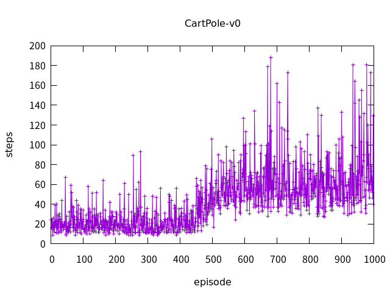

# CartPole-v1

```bash
pip install gym click
pip install -U git+https://github.com/cympfh/gnuplot-py.git
```

## simple manual rule

Solved completely.

```bash
python ./manual.py debug
(shows verbose logs and rendering)

python ./manual.py test  # shows the results of 100 episodes
average=500.0 max=500.0 min=500.0
```

## Q learning

with `pytorch`.

```bash
python ./q.py -E 10000 --agnostic
```


